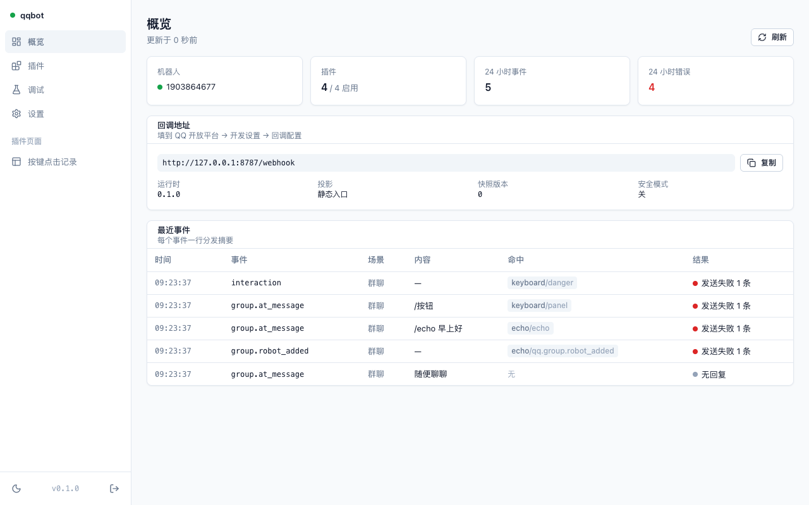

# qqbot-workers

运行在 Cloudflare Workers 上的 QQ 官方机器人插件框架。QQ Webhook 已免 IP 白名单，一个 Worker 就是一个永久在线、零服务器的机器人。

```
QQ 开放平台 ──POST /webhook──▶ Worker
                               ├─ Ed25519 验签 · 时间窗 · 事件去重
                               ├─ 标准化为 Session
                               ├─ 中间件链 → 命令 / 正则 / 事件匹配（priority / block）
                               └─ 插件处理器 → session.reply() → QQ OpenAPI
```

## 仓库结构

| 目录 | 包名 | 作用 |
| --- | --- | --- |
| `packages/sdk` | `@qqbot/sdk` | 插件契约：类型、`definePlugin`、`extractManifest`、测试工具。零运行时依赖 |
| `packages/api` | `@qqbot/api` | QQ OpenAPI 客户端：Ed25519 签名/验签、AccessToken、消息与富媒体 |
| `packages/runtime` | `@qqbot/runtime` | Worker 运行时：Webhook 网关、分发器、上下文注入、快照、管理 API、D1 清单与安装账本、Builds 触发 |
| `packages/projector` | `@qqbot/projector` | 清单 → bundle 投影、Cloudflare Versions API 部署、Builds API 客户端、`qqbot-project` CLI |
| `packages/plugin-cli` | `@qqbot/plugin-cli` | `qqbot-plugin build`：把插件打成单文件 ESM 并抽出 manifest.json |
| `packages/ui` | `@qqbot/ui` | 管理面板（Vue 3），构建为可嵌入 Worker 的资源表 |
| `packages/ui-bridge` | `@qqbot/ui-bridge` | 设计 token、面板 ↔ 插件页面的 postMessage 桥 |
| `plugins/*` | `qqbot-plugin-*` | 示例插件：echo、multi-reply、image、keyboard（按键面板与回调）、t2i（AstrBot T2I 渲染服务，导出 `t2i` 服务给其他插件）、sid（内置，查 OpenID/会话 ID/群角色） |
| `apps/seed` | — | 种子应用：Fork 后连接 Cloudflare 即可部署 |
| `scripts/bootstrap/` | — | 引导部署：headless.mjs（无 UI）与 wizard.mjs（Quick Tunnel 网页向导），由根目录 `.github/workflows/bootstrap.yml` 调用 |
| `scripts/probe-qq-api.mjs` | — | QQ OpenAPI 探测脚本：实测接口真实形状（凭证从线上 KV 或 .dev.vars 读，不回显） |
| `templates/plugin` | — | 插件仓库模板（CI workflow + 声明清单约定） |
| `docs/design.md` | — | 设计决策记录 |
| `docs/capabilities.md` | — | QQ 平台能力 → 插件契约对照表（哪些已封装、哪些走 `api.raw`） |
| `docs/ui.md` | — | 面板与插件页面（iframe + bridge）说明 |
| `design-system/` | — | 设计系统（token、密度、动效、字体规则） |

## 快速开始（本地）

需要 Node ≥ 22（wrangler 要求）与 pnpm 10。

```bash
pnpm install
pnpm test                              # 全部单测
cp apps/seed/.dev.vars.example apps/seed/.dev.vars   # 填 BOT_APPID / BOT_SECRET / ADMIN_TOKEN
pnpm dev                               # wrangler dev，本地 KV/D1/R2
```

打开 http://localhost:8787 用 `ADMIN_TOKEN` 登录面板：概览、插件开关与配置、事件模拟器（不真正发消息）、设置。



## 写一个插件

```ts
import { definePlugin } from '@qqbot/sdk'

export default definePlugin<{ greeting: string }>({
  name: 'hello',
  defaultConfig: { greeting: '你好' },
  commands: {
    // 返回值就是回复
    hello: ({ ctx, argText }) => `${ctx.config.greeting}，${argText || '朋友'}`,
    // 生成器连续回复多条，msg_seq 由运行时编号
    async *count() { for (let i = 1; i <= 3; i++) yield `${i}` },
    // 需要元数据时用对象形式
    pic: { description: '发图', handler: () => ({ image: { url: 'https://…/a.png' } }) },
  },
  regex: { '/^ping$/i': () => 'pong' },
  events: { 'qq.group.robot_added': () => '大家好' },     // 走 event_id 被动回复
  cron: { daily: { cron: '0 1 * * *', handler: async ({ ctx }) => { /* 主动推送 */ } } },
})
```

**完整指南见 [docs/plugin-guide.md](docs/plugin-guide.md)**——事件、配置、存储、生命周期，只看一篇即可写出能用的插件。

按键与回调：

```ts
import { button, keyboard } from '@qqbot/sdk'

commands: {
  menu: () => ({
    text: '请选择',
    keyboard: keyboard([[button.callback('确认', 'order:1', { id: 'confirm' }), button.link('帮助', 'https://…')]]),
  }),
},
buttons: {
  confirm: ({ buttonData }) => `已确认 ${buttonData}`,   // 返回消息即回复并自动 ack 0
  deny: () => 4,                                        // 返回数字作为回应平台的 code（4 = 无权限）
},
```

插件拿到的全部能力都来自注入的 `session` 与 `ctx`（`kv` / `db` / `r2` / `api` / `logger` / `service()`），不 import 运行时。`session` 还提供 `typing()`、`stream()`、`recall()`、`quote`、`interaction`；`ctx.api.group.*` 是群管理接口。完整对照见 `docs/capabilities.md`。复制 `templates/plugin` 起一个源码仓库，`qqbot-plugin build` 生成 `dist/plugin.js` + `dist/manifest.json`，把 `manifest.json` 提交进仓库作为声明文件，机器人面板按 `git:owner/repo@commit` 安装即可——不发布 npm、不发制品。

## 部署模型

- **插件以源码分发，在构建机编译**。插件是源码仓库（`git:<owner>/<repo>@<commit>`），作者把 `qqbot-plugin build` 生成的 `manifest.json` 作为声明文件提交进仓库；面板与安装器只读声明，不执行插件代码。
- **清单真相分层**：框架版本与内置插件在仓库的 `qqbot.manifest.json`（git 管）；已安装插件集在 D1（`rt_manifest_plugins`，操作全程记 `rt_installs` 账本）。两者在构建时合并，D1 同名覆盖。
- **装/卸插件 = Worker 改 D1 清单 + 调 Builds REST API 触发重建**；构建机拉源码编译、校验"声明清单 == 抽取清单"，再走 Versions API 上传 → 预览健康检查 → 切流量。Worker 里只有触发凭证，没有部署凭证。
- 本地 `pnpm --filter @qqbot/seed project` 与构建机跑同一投影库，产出一致（投影哈希相同）。
- 启用/禁用/改配置只改 KV 快照，不触发构建：`PATCH /admin/plugins/:name`。

设置步骤见 [apps/seed/README.md](apps/seed/README.md)：fork 后运行根目录的 **Bootstrap** 工作流（网页向导或无 UI）即可完成首次部署。

## 运行时路由

| 路径 | 说明 |
| --- | --- |
| `POST /webhook` | QQ 回调地址（在开放平台填 `https://<你的域名>/webhook`） |
| `GET /healthz` | 健康检查，含投影哈希 |
| `/` | 管理面板（传入 `ui` 时） |
| `/admin/*` | 管理 API，需 `Authorization: Bearer <管理密钥或会话令牌>`；建议再挂 Cloudflare Access |
| `/p/<插件>/*` | 插件自己的 HTTP 路由；`auth: 'admin'` 的接受面板会话或该插件的桥接令牌 |

## 状态

M1 + M2 + 面板安装：契约、运行时、投影器、CLI、示例、种子、管理面板与插件页面桥均已实现，单测 321。插件清单已入 D1（安装/卸载端点 + 安装账本），`GET /admin/build-manifest` 供构建机拉取，`POST /admin/builds` 经 Builds REST API 触发重建并同步状态与 commit；seed 自部署脚本（源码构建 + Versions API 健康检查部署）已实现并本地跑通。面板插件页支持粘贴仓库链接安装并查看构建记录。插件数据归框架管：D1 表名前缀强制（SQL 写 `{表名}` 占位）、卸载走 `onUninstall` + 按前缀兜底清理、`GET /admin/storage` 看用量与孤儿数据。**Builds 线上实测尚未完成**。详见 `docs/design.md`、`docs/plugin-guide.md`、`apps/seed/README.md`。

> `@qqbot` 这个 npm scope 只是占位，发布前请改成你自己的。
