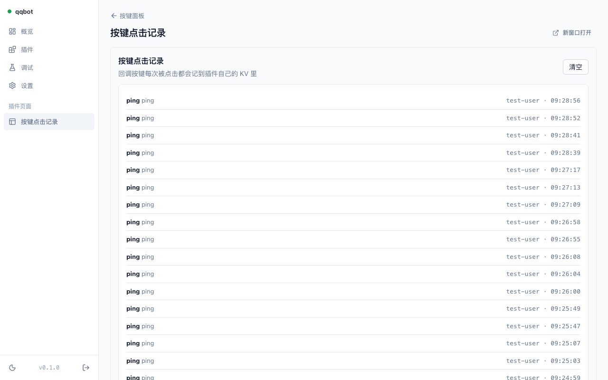

# 管理面板与插件页面


## 面板（`@qqbot/ui`）

Vue 3 + Vite + Tailwind v4，hash 路由。构建产物由 `scripts/pack.mjs` 打成一张"路径 → 内容"表（`dist/ui.js`），作为普通模块进入 Worker bundle，由运行时在 `/` 下带 ETag 返回。不加载任何外部资源，字体用系统栈。

| 页面 | 作用 |
| --- | --- |
| 登录 | 用 `ADMIN_TOKEN` 换 7 天会话令牌（HMAC 签名、无状态），浏览器不再保存管理密钥 |
| 概览 | 机器人状态、插件数、24h 事件/错误、回调地址一键复制、最近事件表（每事件一行分发摘要） |
| 插件 | 列表开关（即时生效）、详情页按 JSON Schema 渲染配置表单、优先级、触发器清单 |
| 调试 | 事件模拟器：消息 / 按键点击 / 其他事件，显示会话解析、命中插件、出站消息、交互回应、流式分片、撤回 |
| 设置 | 凭证保存（先向 QQ 验证）、安全模式、命令前缀 |
| 插件页面 | 侧栏「插件页面」下按插件出现，见下节 |

设计 token 与规则见 `design-system/qqbot-workers/MASTER.md`；机器可读版本是 `@qqbot/ui-bridge/tokens.css`。

## 插件页面（解耦方案）

插件页面是**插件自己的路由返回的任意 HTML**，跑在 sandbox iframe 里，与面板框架无关。

```ts
export default definePlugin({
  name: 'foo',
  ui: { path: '/ui/', title: '我的页面' },          // 面板据此加菜单项
  routes: [
    { method: 'GET', path: '/ui/*', auth: 'admin', handler: async () => html(PAGE) },
    { method: 'GET', path: '/api/data', auth: 'admin', handler: async ({ ctx }) => Response.json(await ctx.kv.getJSON('data')) },
  ],
})
```

页面里：

```html
<link rel="stylesheet" href="/tokens.css" />        <!-- 与面板同色同字，跟随明暗 -->
<script type="module">
  import { createBridge } from '/bridge.js'         <!-- 协议版本永远与面板一致 -->
  const bridge = await createBridge()
  const res = await bridge.fetch('/api/data')       <!-- 自动带桥接令牌，相对路径以 /p/foo 解析 -->
  bridge.toast('已加载', 'success')
  bridge.setTitle('我的页面')
  bridge.resize()                                   <!-- 上报高度，面板自动撑开 iframe -->
  bridge.onTheme((t) => ...)
</script>
```

工作方式：

1. 面板向 `/admin/plugins/foo/bridge` 取一个 **1 小时、限定 foo** 的桥接令牌，首次通过 `?token=` 传给 iframe（iframe 首个请求带不了 Authorization 头），之后通过 postMessage 每 45 分钟刷新。
2. iframe 带 `sandbox="allow-scripts allow-forms allow-popups allow-downloads"`，没有 `allow-same-origin`，所以是 opaque origin：拿不到面板的 localStorage 与会话令牌。它对同源接口的请求按跨域处理，因此面板资源与 `/p/*` 路由都返回 `Access-Control-Allow-Origin: *`——令牌走头部不走 cookie，放开 CORS 不扩大权限。
3. 运行时对 `auth: 'admin'` 的路由接受面板会话或**本插件**的桥接令牌，其他插件的令牌一律 401。`RouteInput.authenticated` 告诉公开路由当前请求是否已登录。
4. 有构建步骤的插件页面（Vue/React 等）用 `serveAssets('/ui/*', assets)` 一行托管构建产物，制品内联进 `plugin.js`。

示例：`plugins/keyboard` 的「按键点击记录」页面——回调按键把点击写进插件自己的 KV，页面通过桥读出来并可清空。



## 本地开发

```bash
pnpm dev                       # 构建面板并启动 wrangler dev（:8787）
pnpm --filter @qqbot/ui dev    # 面板热更新（:5173，/admin 与 /p 代理到 8787）
```
